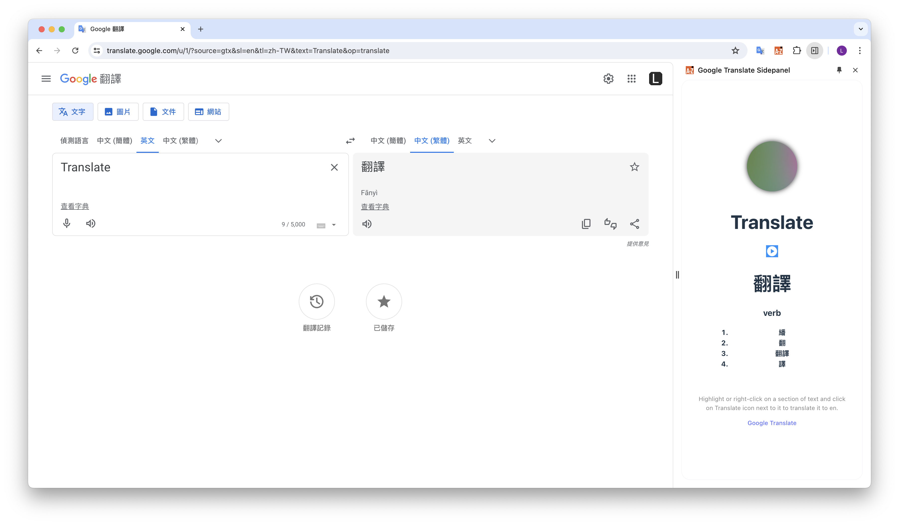
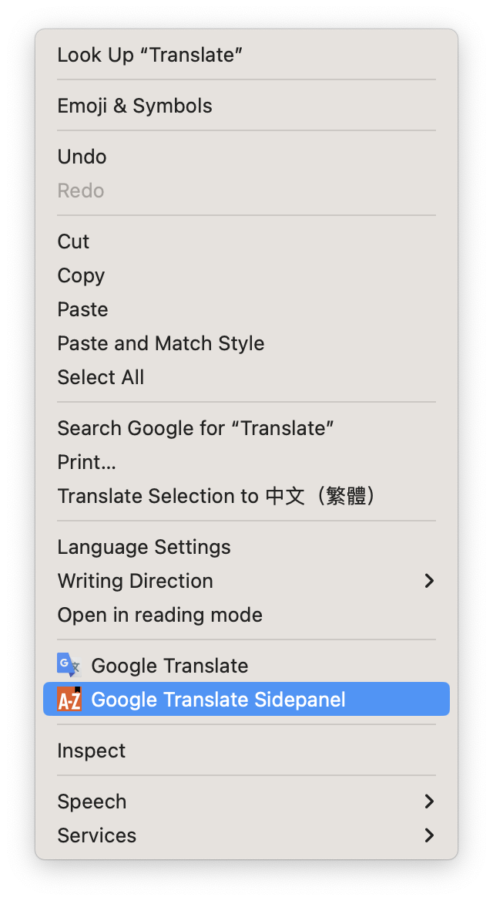

# Google-Translate-Sidepanel
View translations easily as you browse the web. Highlight or right-click on a section of text and click on Translate icon next to it to translate it to your language. 

## Running this extension
1. Download [dist.zip](https://github.com/srleohung/Google-Translate-Sidepanel/releases/download/v0.1/dist.zip) from the [latest release](https://github.com/srleohung/Google-Translate-Sidepanel/releases/tag/v0.1).
2. Go to [Extensions](chrome://extensions/)
3. Unzip and load the directory in Chrome as an [unpacked extension](https://developer.chrome.com/docs/extensions/mv3/getstarted/development-basics/#load-unpacked).
4. Click the toggle on the "Google Translate Sidepanel" extension.

You should see this on the menu when you right-click:

## References
- https://github.com/GoogleChrome/chrome-extensions-samples
- https://github.com/plashenkov/Chrome-Translate